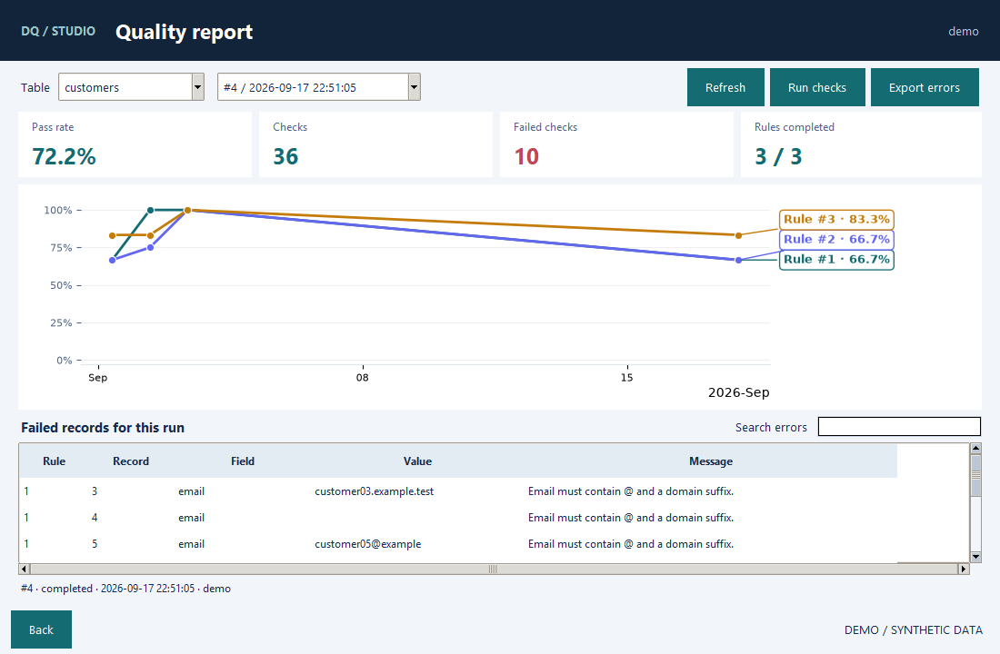
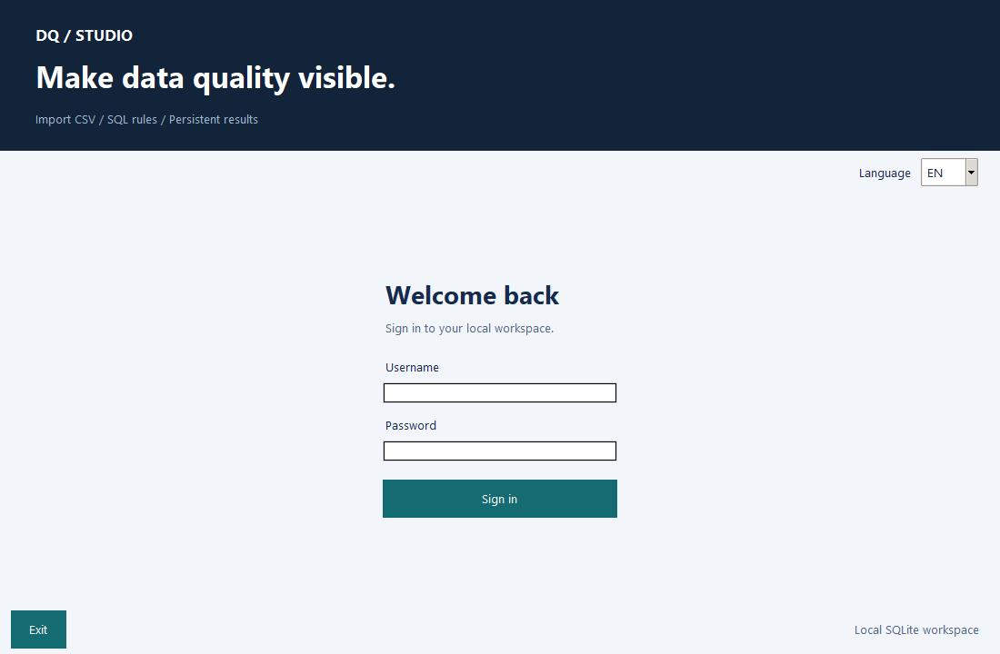

# DQ Studio

### Make data quality visible.

[](https://github.com/alan-przybylski/python_DQ_Application/actions/workflows/tests.yml)


**Turn CSV files and Databricks snapshots into traceable, local data quality checks.**

A local Python / SQL / Data Quality portfolio project by **Alan Przybylski**.
Import a dataset, define SQL rules, run checks, and investigate failed records
alongside historical quality trends. This standalone repository starts with a
clean history, separate from the original course project.



[Try the demo](#quick-start) · [Walkthrough](docs/DEMO.md) · [Architecture](docs/ARCHITECTURE.md) · [Changelog](CHANGELOG.md)

## One workspace, from import to investigation

| Step | What you can do |
|---|---|
| Import | CSV with table-specific templates, or read-only Databricks downloads into local SQLite |
| Prepare | Preview data, map columns, edit table columns with backup and guarded type conversion |
| Define | Add SQL rules for any dataset, archive versions and revise inactive rules |
| Run | Execute one rule or all active rules; each execution gets its own persistent run ID |
| Investigate | View KPI cards, trends and searchable failed records for the selected run |
| Export | Save an entire dataset or the selected run's errors to a chosen CSV file |
| Manage | Assign superuser/user roles, change passwords and deactivate accounts |
| Localize | Switch PL/EN at sign-in; the preference is remembered locally |

Consistent window sizes, scrollable tables and a shared navy/teal theme.
The demo includes **12 fictional customers, 3 SQL checks and 3 linked runs**
showing a data cleanup journey.

## Quick start

**Windows desktop · Python 3.14 with Tkinter · [uv](https://docs.astral.sh/uv/)**

```powershell
git clone https://github.com/alan-przybylski/python_DQ_Application.git
cd python_DQ_Application
uv sync --frozen
uv run --frozen python main.py --demo
```

A **fresh** demo uses **`demo` / `Demo2026`**.
Existing demo databases are reused, never reset; their passwords remain unchanged.
Demo data lives in `data/demo.db`, separate from your private `data/app.db`.

Open **Quality report** directly from the main menu. Import
`samples/customers_with_issues.csv`, run all customer checks, inspect the failed
records, then repeat with `samples/customers_clean.csv`.

### Double-click launch on Windows

After the one-time `uv sync --frozen` setup, double-click:

- `Start DQ Studio.cmd` for your local application database.
- `Start DQ Studio Demo.cmd` for the isolated synthetic demo.

The launchers use the project's own `.venv` and work from any folder, including
paths with spaces. A console may flash briefly; the application then runs without
a persistent terminal. Missing environments display setup instructions. Startup
errors display a dialog; diagnostics are in the Git-ignored `data/launcher.log`
(replaced on each launch). No dependencies are installed automatically.

For a desktop shortcut, right-click the normal launcher and choose **Send to →
Desktop (create shortcut)**. Keep the launcher in the project folder. After updates,
the same shortcut continues to work; only moving the project requires changing it.
Close the app before updating and run `uv sync --frozen` when dependencies change.

### SQL editor

Open **SQL editor** from the workspace. Select a dataset table and click
**Preview table**, or write SQL and press **Ctrl+Enter**. A selection runs on its
own; otherwise the whole editor runs. Queries read the current application database
(or the isolated demo database when launched with `--demo`).

The resizable view shows tables and columns beside the editor and results.
Previews are read-only, limited to 500 displayed rows and 10 seconds, and can be
cancelled. Internal application tables are excluded, as in the rule engine.
Use **Rule template** for a starting check, then **Create rule** to transfer the
SQL into the existing rule form. Choose the target table and complete the details;
saving validates the full rule using the existing rule engine.

### DQ tickets and rule severity

Rules have **Low**, **Medium** or **High** severity; existing rules default to
Medium. A failed check creates one open ticket per rule and dataset, with a
deadline of **7 / 3 / 1 calendar days**, respectively, from ticket creation.
The ticket snapshots severity and deadline; retries and rule edits do not move them.

Open **DQ tickets** to filter open, overdue or assigned tickets. The check runner
is the reporter and initial assignee. The latest importer and source filename are
recorded separately when available. The reporter, assignee or a superuser can
reassign the ticket, add comments and move it through New, In progress and To verify.
Successful checks with at least one record and no failures close it automatically.
SQL errors, empty checks and skipped rules never close tickets. Recurring failures
update the open ticket; failures after closure create a new ticket.

The detail view links to the latest failing run's records (up to 500) and keeps an
activity log. Existing results are not retroactively turned into tickets; run a
check to start the workflow. Ticket records and comments stay in the local database.
Permanently deleting a rule cancels its open tickets with the status **Rule deleted**,
retaining their activity history; deleted result records are no longer available.

### Rules in Git

The rule library offers **Import rule files** and **Export rule files** for
superusers. Each rule is stored as readable TOML metadata plus a separate SQL file.
The [`rules/`](rules/README.md) directory includes two opt-in examples.
Stable keys prevent duplicate imports; changed definitions create a new version
and retain the old definition in history. An import is atomic across all files.

Run local checks in the desktop application. Databricks checks can be started
from the application or scheduled independently using the supplied notebook.

### Application tour

Real application windows, captured using temporary synthetic data only:



### Use your own data

```powershell
uv run --frozen python main.py
```

On first normal launch, an empty database opens **Create your administrator**.
Choose a username (prefilled with `Admin`), enter and confirm your own password,
then click **Create account**. The first account is a **superuser** and the app
opens immediately. Later launches show the normal sign-in screen.
Only a password hash is stored in the local database; no default administrator
password is distributed. Existing accounts and passwords are never replaced or
reset. The separate demo still uses its own account.

For a custom first account, run `uv run --frozen python -m scripts.init_db --admin your_login`
before the first normal launch. Passwords entered through account management
need **6 characters, an uppercase letter and a digit**. Existing users
and passwords are retained. The account form explains unmet requirements.
Usernames and passwords are case-sensitive at sign-in: `admin` and `Admin`
are not interchangeable. Existing account names and password hashes are unchanged.

Without uv, create a Python 3.14 virtual environment, install
`requirements.txt`, then run `python main.py`.

## Engineering highlights

All rule outputs use **`dq_check = 0` for PASS** and **`dq_check = 1` for FAIL**.
For example: `CASE WHEN email IS NULL THEN 1 ELSE 0 END AS dq_check`.
Existing databases are backed up in `data/backups` and migrated once at startup:
legacy SQL is wrapped to invert its output, including archived definitions,
and detailed result flags are inverted. Historical pass/fail counts and KPI stay
unchanged. Previously exported files remain in their original convention.

- **Atomic writes:** CSV rows, optional new table and import log commit together.
- **Traceable results:** a DQ run links user, time, table, KPI and field-level findings.
- **Guarded SQL:** read-only dataset access, output validation and a per-rule execution timeout.
- **Safe upgrades:** additive SQLite migrations, automatic backup, no invented links for legacy history.
- **Explicit permissions:** account changes and permanent rule deletion require an active superuser, checked in the service layer.
- **Reproducible demo:** locked dependencies, synthetic samples and automated Windows/Linux tests.

## Project structure

```text
main.py           Entry point; optional isolated demo
ui/               Tkinter screens, shared widgets and theme
logic/            Accounts, datasets, rule execution, history and exports
database/         SQLite connections, original schema, additive migrations
config/           Paths, database selection and PL/EN translations
scripts/          Demo, first-user setup, desktop launcher, screenshot capture
samples/          Fictional CSV inputs
tests/            Behavioral regression tests and actual Tkinter workflows
docs/             Walkthrough, architecture and actual screenshots
data/             Private databases, preferences and backups (Git-ignored)
excels/           Legacy export location (Git-ignored generated files)
```

## Tests

```powershell
uv run --frozen pytest -q
# On a Windows desktop:
$env:DQ_GUI_TESTS = '1'
uv run --frozen pytest -q
```

Tests use temporary databases, never private application data. GUI checks cover
20 views in PL/EN at two screen sizes and an import → rule → report → export flow.
CI runs core tests on Windows and Linux, plus GUI tests on Windows.

## Databricks and table editing

The **Rule library** now shows one row per rule, with search, table/status filters
and the latest KPI for the current version only. Open a rule for **Definition**,
**Results** and **Version history**, including a color-coded SQL comparison. Existing
definitions, archived versions and result history are retained without a migration.

**Delete rule permanently** is available only in a rule's details for superusers;
regular users cannot see it. The service rechecks the account's current role and
active status inside the deletion transaction, independently of UI visibility. Explicit
confirmation removes the rule, all its versions, KPI, field results and execution
errors in one transaction. Runs belonging only to that rule are removed; shared
runs retain other rules' results and their counters/status are updated. Cancel is
the default. Use **Deactivate** instead if history should remain. Dataset rows,
existing exported files and backups are not deleted; there is no in-app undo.

In **01 Import CSV**, choose **Import from Databricks** or **Edit table columns**.
The Databricks connector uses browser OAuth and reads a selected
`catalog.schema.table` or view. Download a preview, inspect column mapping, then
explicitly save a new SQLite table or refresh an earlier snapshot of the same
source. DQ rules query that local copy, not your remote warehouse.

Named **connection profiles** persist hostname, HTTP path, catalog, schema and an
optional table locally. Choose, update or delete profiles in the Databricks screen;
the last selected profile is restored on reopening. No passwords or tokens are
saved. Profiles are separate per SQLite workspace (including demo) and Git-ignored.

Column editing supports adding, renaming, deleting, type changes and required
fields. A database backup precedes every change; unsafe conversions, changes to
`id`, and changes to columns used by current active/inactive rules are rejected.
Templates read the updated schema automatically. No existing DQ history is reset.

See the [Databricks setup and safety guide](docs/DATABRICKS.md) for connection
details, refresh semantics, supported types and a small test table.
Remote reads are tested with fakes; live-account validation is still pending.

## Databricks rule and result synchronization

The dashboard's **Databricks sync** screen sends tables and rules using one saved
connection profile. Tables keep their local names in the profile's catalog and
schema. Rules use ordinary SQL; the application resolves dependencies and validates
the translated SQL in Databricks before publication. Results download into reports
and DQ tickets. A portable notebook executes published rules independently.
See the [setup and daily scheduling guide](docs/DATABRICKS_SYNC.md).
Generate the standalone import file with `python -m scripts.build_databricks_notebook`.
Local tests cover synchronization and UI; execution in a live Databricks workspace
still needs validation.

## Cross-table checks

Import tables and write ordinary JOIN, EXISTS or CTE queries in the **SQL editor**.
Use **Create rule** to save the SQL. No reference registry, aliases or separate
cross-table builder is needed. Send each required table to Databricks, then send
the rule from the library. Rules remain runnable locally after publication.
See the [SQL walkthrough](docs/CROSS_TABLE.md). Update the generated notebook
before scheduling rules using this SQL format.

## Local storage

Your private data stays in `data/app.db`; close the app before copying the database
for a backup. The V2 upgrade also creates a pre-migration backup automatically.
CSV exports are explicit snapshots saved where you choose.

Old KPI and findings are preserved; only new executions have linked run history.
This is a local portfolio app, not a production multi-user security boundary:
anyone who can access the SQLite file can bypass application roles. Large imports
and checks still run on the UI thread. Databricks network downloads run in a
background worker with row/memory guards; local snapshot saves remain synchronous.

Read the [architecture and limitations](docs/ARCHITECTURE.md#current-limitations)
and [security notes](SECURITY.md) before using sensitive data.
