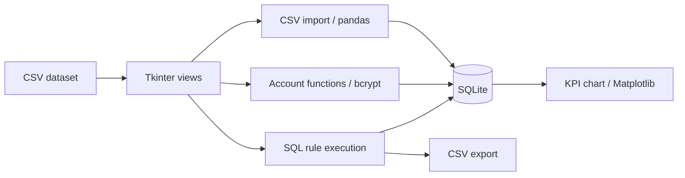

# Architecture & engineering decisions

DQ Studio is a single-user, local desktop application. It demonstrates the complete
path from a CSV import to SQL-based checks, row-level findings and persisted KPI.
There is no web server or external database to configure.

## Code map

| Location | Responsibility |
|---|---|
| `main.py` | Application startup and isolated demo selection |
| `ui/` | Existing windows, navigation and a shared presentation theme |
| `logic/` | CSV import, account functions and KPI retrieval/charting |
| `database/` | Connections, compatibility functions and the schema |
| `config/` | Paths derived from the project directory |
| `scripts/` | Demo seeding, first-admin setup, migration and screenshot capture |
| `samples/` | Deliberately synthetic datasets with and without quality issues |
| `tests/` | Behavioral tests and portable preservation contracts |

Some SQL still lives in UI methods. This is a deliberate boundary of this iteration:
presentation changes did not silently become a business-logic rewrite.

## Storage model

The existing seven-table model is retained:

- `customers`: current imported records; imports update matching IDs.
- `users`: bcrypt hashes, roles and account activity.
- `data_load_log`: import metadata.
- `dq_rules`: current rule definitions.
- `dq_rules_history`: archived rule versions.
- `dq_results`: passed/failed counts for historical rule results.
- `dq_field_results`: recorded field-level findings.

The results tables reference rules, **not a shared run entity**. A specific field
finding cannot be reliably joined to a specific KPI record through a run ID.
Adding that relationship is a future schema decision, not something this app claims
to provide today.

Normal mode stores data in `data/app.db`. Demo mode uses `data/demo.db` and writes
exports to `data/demo_exports/`. The public demo account is never inserted into the
private application database. Existing demo databases are reused, not reset.

## Why SQLite?

It removes a server dependency for a local desktop workflow while retaining existing
data. Every connection enables foreign keys. Dates are local-time ISO-like strings;
rule versions are text so versions such as `1.2` are not truncated to integers.

The optional MySQL migrator verifies records, active-rule outputs, KPI, foreign keys
and database integrity before publishing a new SQLite file. It refuses to overwrite
an existing destination. The MySQL driver is an optional migration dependency,
not a runtime requirement.

`MYSQL_AI_CI`, `REGEXP` and `REGEXP_LIKE` compatibility helpers preserve the checked
legacy use cases. They do not implement every MySQL collation or ICU regex behavior.
New rules should use SQLite syntax.

## Testing boundaries

- Account lifecycle, bcrypt and case-insensitive lookups.
- CSV updates, SQL NULL values and persistence across reopening.
- Single-rule and all-rule execution, KPI and field findings.
- Rule archival and migration refusal/rollback behavior.
- Synthetic demo contents and refusal to overwrite unrelated databases.
- Shared geometry and control visibility in 12 windows at two screen sizes.
- AST-based contracts for existing function names, arguments, SQL and business logic.

The contract fixture contains signatures and hashes, not the original source or Git
history. It keeps regression tests portable in a fresh clone. Changed behavior must
be reviewed deliberately rather than hidden by regenerating the fixture.

## Current limitations

This is a portfolio application, **not a production-hardened data governance platform**.

- CSV import commits individual rows. A failure may leave a partial import, and the
  existing failure message is not a reliable count of committed records.
- Rule SQL must come from a trusted author. App roles and login do not protect the
  underlying SQLite file from someone with filesystem access.
- Rule queries must return `id`, the checked field as the second column, and an
  integer `dq_check` of 0 or 1. The existing engine does not strictly enforce this.
- Existing summary messages and empty/error-result behavior have known ambiguities;
  inspect the actual counts and exported findings rather than a `SUCCESS` label alone.
- Export filenames are reused. The database retains results; CSV files are snapshots,
  not an archive of every execution.
- Automatic opening of an exported file uses Windows APIs. The desktop walkthrough
  is Windows-tested; passing core tests on Linux is not a claim of full Linux GUI support.
- Long imports and checks currently run on the UI thread.

Future work: atomic imports with explicit counts, read-only SQL execution, strict
result validation, a run-level history model and background workers. These change
behavior and are intentionally outside this presentation-focused release.
