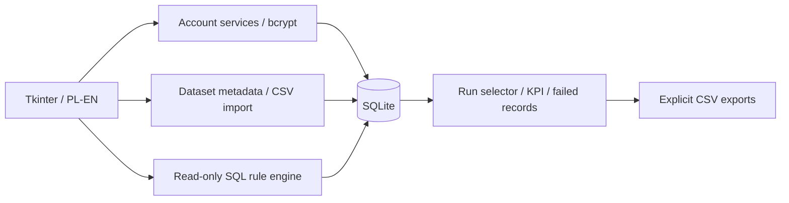

# Architecture & engineering decisions

DQ Studio is a local Tkinter application with SQLite storage and embedded
Matplotlib charts. There is no web server or database service to configure.



## Code map

| Component | Responsibility |
|---|---|
| `ui/` | Navigation, forms, consistent geometry, preview and report interaction |
| `logic/accounts.py` | Password validation, roles, actor authorization, last-superuser protection |
| `logic/datasets.py` | Dataset allowlist, column metadata, parsing, atomic imports and exports |
| `logic/dq_engine.py` | Read-only evaluation, result validation, run lifecycle and history queries |
| `logic/rules.py` | Rule creation, archival and versioned reactivation |
| `logic/dq_report.py` | KPI retrieval and chart rendering |
| `database/` | Connections, compatibility helpers and additive schema upgrades |
| `config/i18n.py` | Application-owned PL/EN strings and local language preference |

Existing public entry points remain; account administration accepts an additional
actor argument. Some read-only view queries remain in UI classes. The V2 changes
are deliberate behavior changes, not presented as byte-identical business logic.

## Storage model

The original seven tables remain: `customers`, `users`, `data_load_log`,
`dq_rules`, `dq_rules_history`, `dq_results` and `dq_field_results`.
New datasets are separate user-defined SQLite tables.

V2 adds `dq_runs`: ID, table, username, start/end times, single/all mode, execution
status, rule counts and execution errors. Both result tables gain a nullable
`run_id` foreign key with an index.

```text
dq_runs.id
  ├── dq_results.run_id       → counts for each rule and version
  └── dq_field_results.run_id → tested values, outcomes and messages
```

Old results keep `run_id = NULL`: timestamps alone cannot reliably reconstruct
which results belong together. They remain on the trend chart; linked run cards
and failed-record lists start with new executions. Run IDs distinguish checks
even when their timestamps fall in the same second.

Normal mode uses `data/app.db`; demo mode uses `data/demo.db`. A fresh demo gets
synthetic users, data and linked results. Existing demo data is never reseeded.
Language choice is saved separately in `data/settings.json`.

## Transactions and history

- Import validates the entire file, including mapped column types and duplicate
  IDs. Table creation, data changes and the import log share one transaction.
- Existing IDs update only mapped columns; generated/omitted integer IDs append.
  New tables support TEXT, INTEGER and REAL; missing ID gets an integer primary key.
- Each DQ run reserves a writer transaction and evaluates rules on a separate
  read-only snapshot. A rule's KPI and details use a savepoint: both persist or
  neither persists. The reader is closed before committing the writer.
- An SQL execution error does not become a fake failed data check. A run records
  completed/partial/failed/no_rules and exposes execution errors separately.
- Zero returned records produce zero passed/failed checks and no pass percentage.
- Exports use a temporary file and replacement only after successful writing.
  They are user-chosen CSV snapshots, not automatic archives.

## SQL contract and permissions

A rule must return `id`, the tested field as the second column, and numeric
`dq_check` values of 0 or 1. Other columns may be present, with unique names.
The engine rejects missing IDs and malformed output. An SQLite authorizer and
query-only mode prohibit mutation, schema operations and reads of internal tables.
Cross-dataset SELECTs are allowed. A SQLite progress handler applies a best-effort
ten-second query timeout; it cannot interrupt a Python regex callback mid-call.

Only an active superuser may create/modify/deactivate users. The last active
superuser cannot be demoted or deactivated. Bcrypt hashes are retained; old
`admin` roles become `superuser`, with no password reset. Policy validation applies
only to new/changed passwords, so legacy login continues to work.

## Migration and compatibility

Initialization loads the original seven-table baseline, then applies the
idempotent V2 migration. Established databases receive a SQLite backup before
schema or role changes. Foreign keys are enabled for every connection.

The optional MySQL importer still accepts exactly the original seven-table
snapshot. It verifies every row, existing rule output, historical KPI and integrity
before publishing a new SQLite file, refusing to overwrite a destination.
It does not migrate arbitrary new MySQL tables. Subsequent app initialization
normalizes legacy roles.

`MYSQL_AI_CI`, `REGEXP` and `REGEXP_LIKE` preserve tested legacy use cases, not
all MySQL collation or ICU behavior. New rules should use SQLite syntax.

## Testing boundaries

Core tests cover passwords, authorization, migration backups, unchanged historical
rows, atomic rollback including DDL, mapping, leading-zero text IDs, CSV exports,
rule restrictions, partial runs and independent histories. GUI tests open 15
views in both languages at 1920×1080 and 1366×768, and exercise an actual
import → new-table rule → run → error export workflow.

The original preservation fixture remains unchanged. Public entry-point checks
and hashes for unaffected SQL remain; explicitly approved V2 behavior is tested
semantically rather than overwriting old hashes to claim nothing changed.

## Current limitations

- This is trusted local desktop software, not a production multi-user platform.
  File access bypasses login and role permissions; SQLite files are not encrypted.
- CSV parsing and rule results are held in memory; large workloads block the UI.
  Query timeout limits execution, not a hard process-wide memory budget.
- Dates use local wall time, not timezone-aware UTC.
- Rule SQL, dataset names, stored messages and database error details are not
  machine-translated. Native file dialogs follow the operating system language.
- CSV empty fields become SQL NULL; default export formula protection prefixes
  text beginning with formula markers. Disable that option for raw values.
- CSV templates contain headers, not a full external type/schema specification.
- Historical results are stored, but source CSV files and entire dataset versions
  are not automatically archived.
- Screenshots and GUI are Windows-tested. Linux core tests are not a promise
  of full Linux desktop support.
