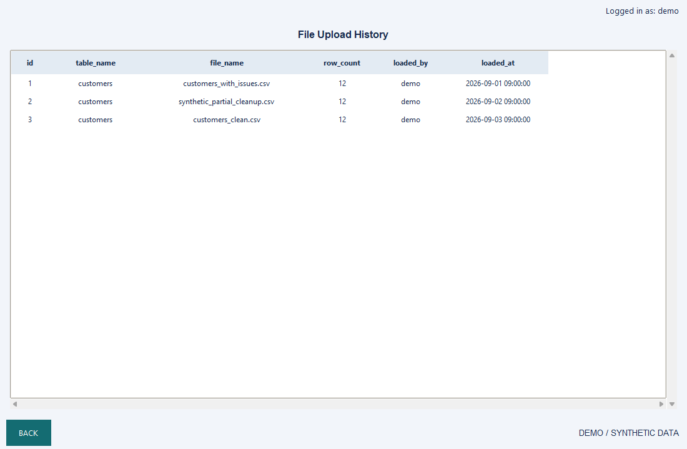

# A two-minute walkthrough

Start with `uv run --frozen python main.py --demo` and sign in with
`demo` / `demo-only-2026`. These credentials are intentionally public and belong
only to the synthetic demo database.

1. Open **Rules & quality results**. The rule library contains email format, age
   range and required-name checks, expressed as SQL.
2. Select **Check DQ** to see three days of seeded synthetic results. Each percentage
   is calculated from the matching sample records, not a hand-drawn chart.
3. Return to the workspace and import `samples/customers_with_issues.csv`.
4. Open **Check DQ → Run DQ Check**, select `customers` and **All Rules**, then run.
   The new counts and findings are stored in the demo database. The CSV export opens
   on Windows if a default application is associated with CSV files.
5. Import `samples/customers_clean.csv` and repeat the checks. All three checks
   should pass for the 12 synthetic records.
6. Reopen the results view to refresh the chart. Check **Browse import history**
   to see the imports. Close and reopen the demo: your new results remain.

The initial history is dated 1–3 September 2026. New checks use your computer's local
date. An import alone does not run the rules automatically.

## Rule contract

Return one record per customer, with `id`, the tested value, and `dq_check`:

```sql
SELECT id,
       age,
       CASE WHEN age BETWEEN 18 AND 120 THEN 1 ELSE 0 END AS dq_check
FROM customers;
```

`1` means pass and `0` means fail. SQL is for trusted authors; see the
[known limitations](ARCHITECTURE.md#current-limitations) before using real data.

## Screenshots




These are actual application captures with temporary synthetic data. Recreate them
on a Windows desktop with `uv run --frozen python -m scripts.capture_demo`.
