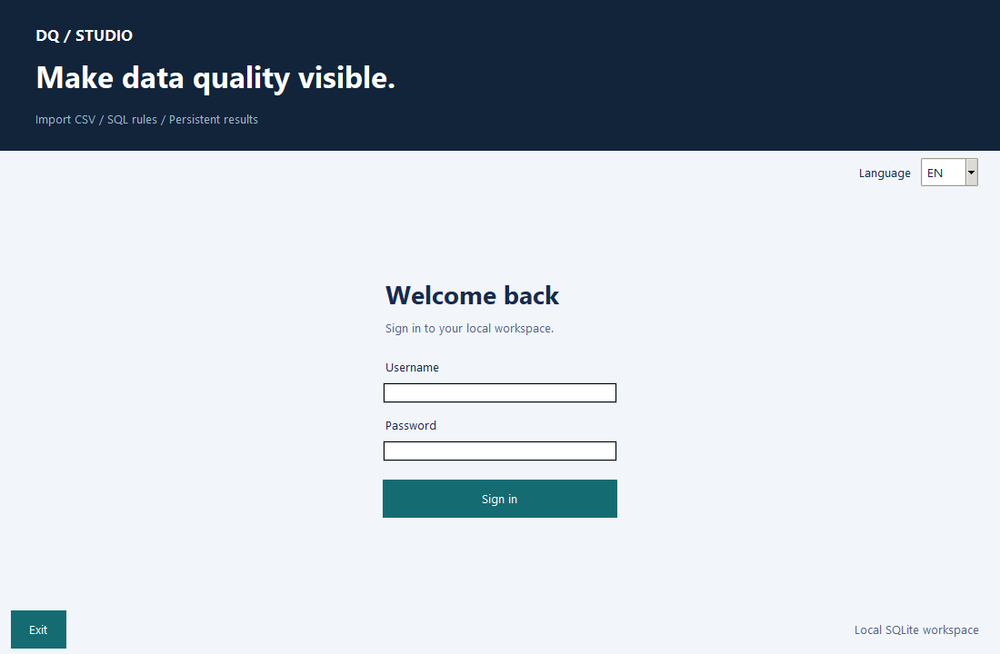
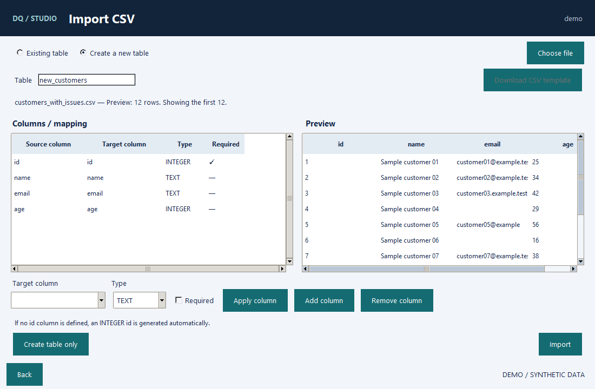
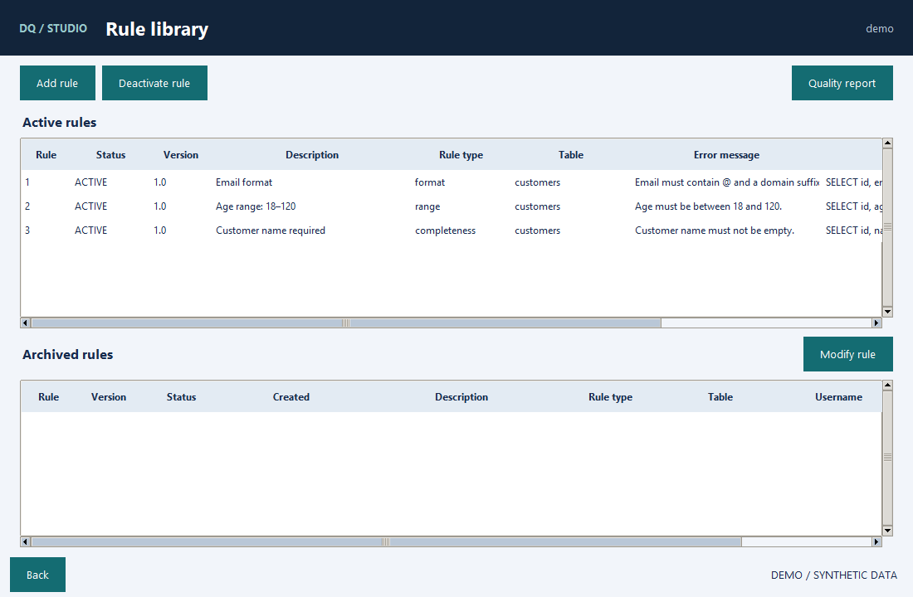

# A short walkthrough

Start with `uv run --frozen python main.py --demo`.
A **new** demo uses `demo` / `Demo2026`; existing passwords stay unchanged.
Choose **EN** or **PL** at sign-in. The following labels use EN.

## Investigate a quality issue

1. Open **Rules & quality results → Quality report**. Seeded runs show three
   cleanup stages; use the run selector to inspect their KPI and failed records.
2. Return to **Import CSV**, select **Existing table → customers**, and choose
   `samples/customers_with_issues.csv`. Review the preview/mapping, then **Import**.
3. Open **Quality report → Run checks → All rules**. The report refreshes to the
   new run: cards, chart and failed-record list refer to that execution.
4. Search the error list, double-click a row for details, then **Export errors**.
   Choose a filename. This exports all failures in the selected run, not only
   the currently filtered list.
5. Import `samples/customers_clean.csv` and run again. All 36 checks should pass
   (12 records × 3 rules). Older runs and their failures remain selectable.
6. Use **Export table** to export current table data. Import history lists source
   filenames, users, dates and row counts. Close/reopen: history persists.

The initial runs are dated 1–3 September 2026. New runs use local time.
An import does not automatically execute quality rules.

## Create your own dataset

1. In **Import CSV**, choose **Create a new table** and enter a name such as
   `orders`.
2. Choose a CSV: headers propose columns and types. Select a column, adjust its
   name/type/required flag, then **Apply column**. Leading-zero identifiers are
   proposed as TEXT, not integers.
3. Alternatively use **Add column** to define columns manually and **Create table
   only**. If you omit `id`, an integer ID is added automatically.
4. **Import** creates the table and imports the file in one transaction. A bad row
   rejects the entire operation.
5. The table is immediately available in **Add rule → Table**, **Quality report**
   and **Export table**.
6. For later imports, choose **Existing table** and **Download CSV template**.
   The template contains that table's headers. Unknown CSV columns must be mapped
   or explicitly marked **Ignore**.

Table/column names use letters, digits and underscores and cannot start with a
digit. Numeric decimals use a dot. CSV supports UTF-8/BOM and legacy CP1250, with
comma, semicolon, tab or pipe delimiters. Repeated IDs within one file are rejected;
IDs already in the database update matching records.

## Rule contract

For a table containing `id` and `age`:

```sql
SELECT id,
       age,
       CASE WHEN age BETWEEN 18 AND 120 THEN 1 ELSE 0 END AS dq_check
FROM customers;
```

The tested field must be second; `1` means pass and `0` fail. Queries are
read-only and can access dataset tables, not accounts or internal history.

## Account management

**Manage users → Create user / Modify user** provides a `superuser`/`user`
selector. Passwords require six characters, one uppercase letter and one digit.
The checklist updates while typing and a rejected password explains what is
missing. Leave the password blank during modification to retain the current hash.

## Screenshots







Actual application captures with temporary synthetic data. Regenerate on Windows
with `uv run --frozen python -m scripts.capture_demo`.
